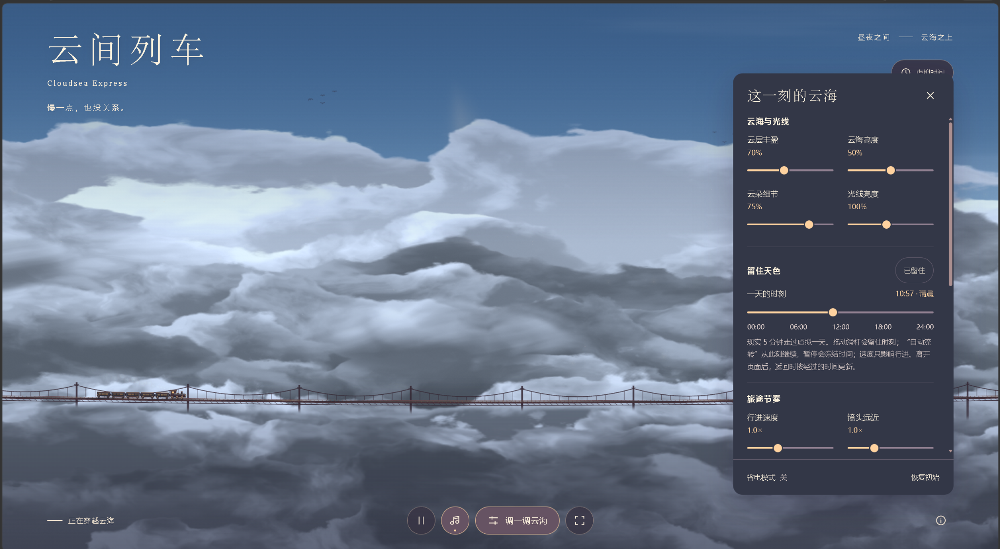

# 云间列车 · Cloudsea Express

一个可交互的实时云海列车场景，使用原生 JavaScript、WebGL、Canvas 和 Web Audio。无需安装依赖或构建，`dist/` 即可作为静态网站运行。

## 项目截图



实际运行画面：云海列车与场景调节面板。

## 快速开始

在项目根目录打开终端，运行：

```sh
python3 -m http.server 8000 --bind 127.0.0.1 --directory dist
```

Windows 如使用 Python Launcher，可改为：

```powershell
py -m http.server 8000 --bind 127.0.0.1 --directory dist
```

然后在浏览器打开 <http://127.0.0.1:8000>。停止服务时在终端按 Ctrl+C。

- 也可以用现有的静态网站服务器，将网站根目录指向 `dist/`。
- 不需要 `npm install`、API 密钥、数据库、外部字体或 CDN。
- 运行时资源均为本地相对路径，可部署于域名根目录或子目录。部署时应保留 `dist/` 内各文件的相对位置。
- 音乐需点击页面中的音符按钮后开始播放。

## 功能与操作

- 镜头跟随蒸汽列车；多层云海、轨道和桥景形成连续视差，车轮和蒸汽随行进速度变化。
- 15 层云海、随机前景流云、四类云形、缓慢涌动，以及有数量上限的浮尘、光点与薄雾。
- 完整昼夜循环：现实 5 分钟对应虚拟 24 小时。晚间有星空、流星与极光，白天有飞鸟和柔和光束。
- 可调云层丰盈、高度、细节、亮度、行进速度、镜头远近、烟囱浓度与前景流云参数。
- “虚拟时间”按钮显示或隐藏时钟；“留住天色”锁定时间，“自动流转”恢复变化。
- 行进速度为 0 时，运动停止而昼夜继续；整体暂停会同时冻结画面运动与虚拟时间。
- 支持暂停、重置、全屏、省电模式、音量和静音；提供移动端布局并尊重系统减少动态效果设置。

## 渲染与性能提示

本包保留完整画质版本，未为 GitHub 导出修改场景、视觉效果或渲染逻辑。

WebGL 云海包含较复杂的着色器。首次加载可能需要较长编译时间；低性能 GPU、软件渲染环境或高负载设备可能出现卡顿、较高耗电或发热。完整画质不是所有设备都能流畅运行。

需要降低负载时，可手动打开页面的“省电模式”或调整细节参数。省电模式不会因为启动慢或掉帧而自动开启；仅 WebGL 实际不可用或编译失败时使用 Canvas 兼容画面。Canvas 与 WebGL 的视觉细节可能不同。

## 测试

在项目根目录使用 Node.js：

```sh
node --test
```

也可以单独运行一个测试：

```sh
node tests/clock.test.js
```

测试不依赖第三方 npm 包，涵盖时钟、云形、随机流云、涌动、粒子、光照、飞鸟、星空、蒸汽、控件与模拟启动流程。它们不替代真实浏览器或 GPU 上的画面与性能测试。

## 文件概览

- `dist/index.html`、`dist/style.css`：页面与控制面板。
- `dist/scene.js`：主场景、云海着色器、构图和交互。
- `dist/train.js`、`dist/track.js`：列车、蒸汽、车轮与轨道。
- `dist/foreground.js`、`dist/morphology.js`、`dist/billowing.js`：随机流云生命周期、云形和连续涌动。
- `dist/lighting.js`、`dist/night-sky.js`、`dist/atmosphere.js`：昼夜、飞鸟、星空、流星、极光与空气粒子。
- `dist/ambient.js`：程序生成的背景音乐。
- `tests/`：11 个原有回归测试文件。
- `ATTRIBUTION.md`：原项目的视觉灵感说明和许可证状态。
- `SOURCE_MANIFEST.sha256`：原样保留的运行源码与测试文件校验值。

`dist/` 在本项目中就是可编辑的运行源码，并非需要重新生成的构建产物。无需额外图片、音频或字体文件。

## 导出来源

运行源码与测试文件取自提交 `68949820103a5325f6459f18fecb5dca36439620`，逐文件保持原样。为方便独立仓库使用，本包整理了说明文档和忽略规则；不包含 Git 历史、部署服务配置、未使用的场景图片或调试记录。

本导出未选择或新增开源许可证。公开仓库前，请由项目所有者决定是否以及采用何种许可证；第三方作品的署名或视觉灵感说明不等同于获得其使用许可。详见 `ATTRIBUTION.md`。
